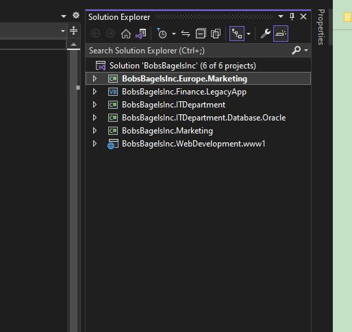
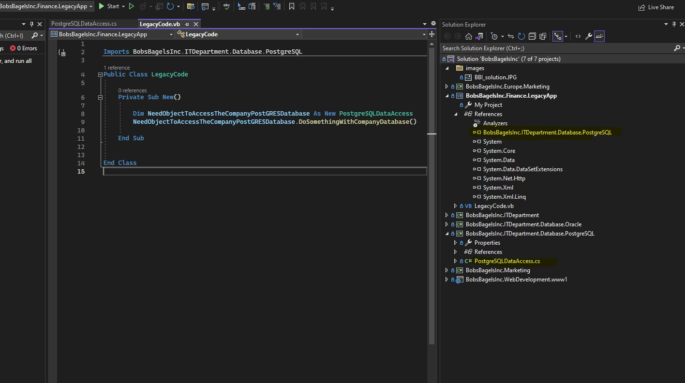

# C# Solution Project Example

## Learning Objectives
- to understand projects and solutions in c#

## Solution Layout
A solution is a useful way of grouping projects.   A companys codebase could reside in a single solution or multiple solutions.  Those solutions may have single or many projects in them!  There is no right or wrong way of laying out a solution and projects.  I have seen solutions with single projects or solutions that contain 30 plus projects.  
Usually the solution/project layout is right at the time it was written, however if a company changes (growing, merging etc), sometimes the solution might evolve.

Imagine Bobs Bagels Inc was once a small firm and you wrote some software for the Marketing team.  You might only have one project   
called BobsBagelsInc.Marketing  in the BobsBagelsInc solution.  Now imagine the company expands across europe and a new european markinging team want some apps buit.  You may well create some code in a project called BobsBagelsInc.Europe.Marketing  
Now imagine the IT Department needs code to access the Oracle database or a new PostgreSQL database.  They could be in two seperate projects?  or should you put all database code in a single project?

## Sharing Code Between Projects - References
The whole point of multiple projects in a solution is the ability to share code.  Imagine you are the C# dev for Bobs Bagels Inc.   Finance come to you with some changes to their finance application which is a legacy app written in VB back in 1999 on Windows ME.  As you can see in the image, the project has been added to the solution.  And its a different language!  Solutions give us the ability to do this.  
The image below shows how the **BobgsBagels.Finance.LegacyApp** written in VB has a **reference** to the **BobsBagelsInc.ITDepartment.Database.PostgreSQL** project which is a current project written in C#.  The VB LegacyCode.vb can now do somethings to our current database by calling the new code.  Itis creating a new instance of the PostgreSQLDataAccess and calling the **DoSomethingWithCompanyDatabase()** method.  You can write some basic VB to call the C# but write the majority of new code in c#?

Don't worry.  We won't be covering VB in this course. :-)

